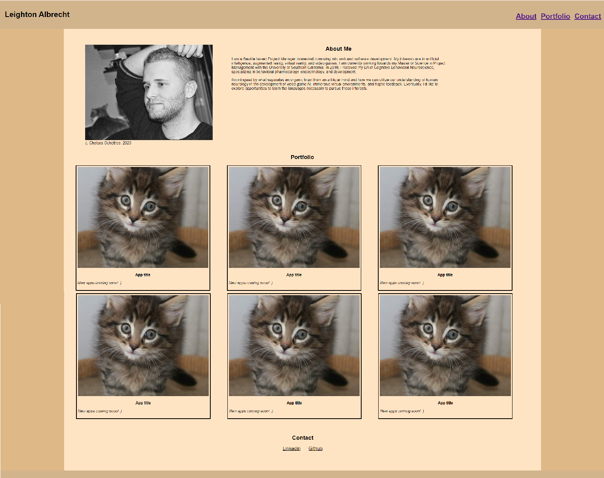

# lba-portfolio

## User Story
An online portfolio is necessary if you want to be employer-ready. If you want to be considered for a position, you have to be able to demonstrate your work to potential employers. Providing them with a portfolio that shows off your abilities as well as gives some insight into who you are as a person

## Usage
The site has cards that lead the visitor to all the apps developed by the author; cards can be added as more apps are developed.
Visitors can navigate to different sections of the site using the navbar at the top of the page
Links to the author's social media pages are available at the bottom of the page

![deployed to Github Pages] (https://lbalbrecht.github.io/lba-portfolio-homework/)

![Github repository] (https://github.com/lbalbrecht/lba-portfolio-homework)

<<<<<<< HEAD

=======

>>>>>>> 83ab54249c3f97c9e0b6abc0b82f2e0c98812d25
